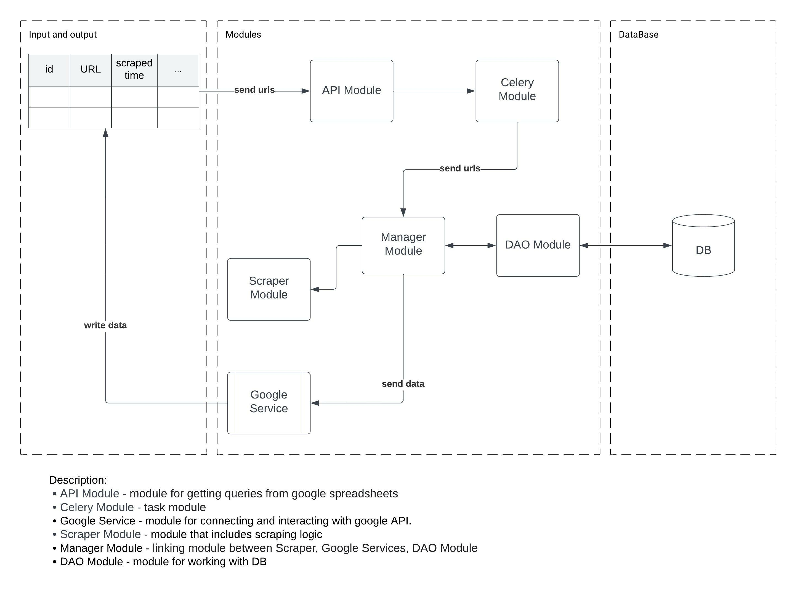

# Roblox Web Crawler 
Current application is the scraper that scrapes endpoints for companies from the website roblox.com.
Scraper associated with GoogleSheet via API endpoint, which receives URL addresses and starts the process of scraping certain data on Roblox games.

## Architecture


### Useful links
- [Google Sheets](https://docs.google.com/spreadsheets/d/1AXnIpDgtXLVdqnEfKFjM7bkMgSl5_tQclYWW2LYREiQ)
- [Google Developers Console for Project Setup and Authentication Settings](https://console.cloud.google.com/apis/dashboard)
- [Google sheets API docs](https://developers.google.com/sheets/api)
- [Roblox Games API docs](https://games.roblox.com/docs)
- [Roblox Badges API docs](https://badges.roblox.com/docs)

### 1. Create .env file and static directory in base directory
>  next to the config.py file, create an .env file and static directory with credentials.json in
> :warning: **Required!**
```text
    .
    ├── ...
    ├── Base dir
    │   ├── dao     
    │   │   └── ...
    │   ├── google_services
    │   │   └── ...
    │   ├── manager
    │   │   └── ...
    │   ├── roblox_api
    │   │   └── ...
    │   ├── scrapers
    │   │   └── ...
    │   ├── utils
    │   │   └── ...
    │   ├── managers
    │   │   └── ...
    │   ├── nginx
    │   │   └── ...
    │   ├── static
    │>>>│   └── credentials.json
    │>>>├── .env      
    │   ├── .env-example          
    │   ├── .gitignore
    │   ├── config.py
    │   ├── docker-compose.yml
    │   ├── Dockerfile
    │   ├── main.py 
    │   ├── README.md
    │   ├── requirements.txt
    │   ├── tasks.py
    │   └── ...
    └── ...
```
>###### Populate with example from .env-example file
---
### 2. Docker
Up docker containers
```bash
docker-compose up -d --build
```
Down docker containers with deleting all images and volumes
```bash
docker-compose down -v --rmi "all"
```
> :warning: **remove the -v --rmi "all" flags**  if you just need to omit containers

Docker logs
```bash
docker-compose logs -f
```
Celery shell
```bash
docker-compose exec celery celery shell
```
---
> :warning: **Attention!** If AppScript is required for google sheet, it is in static file
